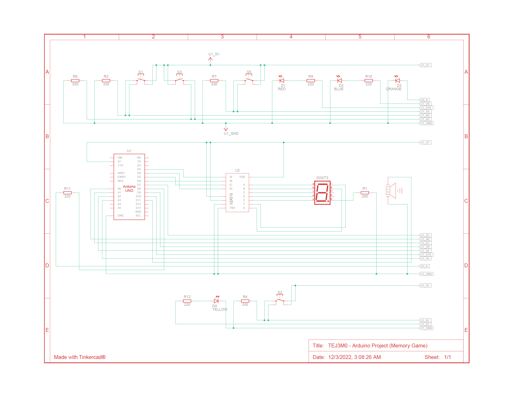

# Memory Game

By Aritro, Byron, and Haris

## Project Description

The project that we chose for our Arduino project was a memory game. The single player game involves the
circuit turning on and playing sounds in a specific sequence, requiring the player to replay that sequence
in the correct order to proceed to the next level. It uses four buttons to input the sequence, four
differently colored LEDs to indicate which button to press, a buzzer to play sounds, and a 7 segment display
to show the user's current score. The game has 10 levels, and the player wins if they can complete them all.
These levels are also randomly generated each time to provide a unique experience to the player. This project is 
completely original, and we didn't follow any online walkthroughs or guides in order to make either the circuit or 
the code.

## Parts List

|       **Component**        | **Quantity** |
| :------------------------: | :----------: |
| 7-Segment Decoder (CD4511) |      1       |
| Cathode 7 Segment Display  |      1       |
|       Arduino Uno R3       |      1       |
|         LED (Blue)         |      1       |
|        LED (Orange)        |      1       |
|         LED (Red)          |      1       |
|        LED (Yellow)        |      1       |
|         Pushbutton         |      4       |
|      Resistor (200Ω)       |      1       |
|      Resistor (220Ω)       |      4       |
|      Resistor (330Ω)       |      4       |
|          Speaker           |      1       |

## Schematic

You can also view the [PDF](media/diagrams/schematic.pdf).

## Diagram (TinkerCAD)

You can view and simulate the circuit in TinkerCAD [here](https://www.tinkercad.com/things/dRhVC8RqspU?sharecode=mX4kNoiZdke6x4hJpInBGDlS2u-rRKsvSmVpOtCBEpc).

## Photo

## Video

https://user-images.githubusercontent.com/29025984/205433689-031c2f9c-bf1a-4e09-9b8a-58713577348a.mp4

## GitHub Pages

https://hariskhawja.github.io/Memory-Game/
